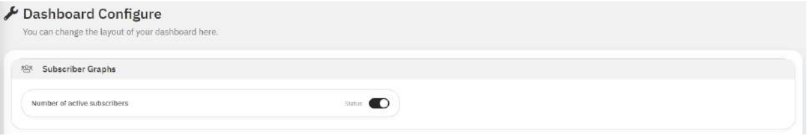
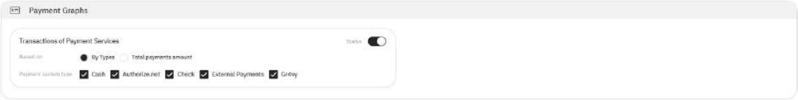
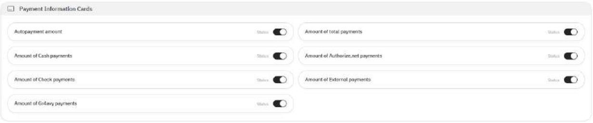

# Dashboard

**Overview:**

Dashboard is an information management tool that visually tracks and displays real-time statistical data and key metrics
to monitor the current situation of business.

***Notes:***

1. *Payments Info Cards, Payment Graphs, Media Information Cards are available only for users with “Super Admin” role.*
2. *Other users have access only to the “Subscriber Graphs” section.*
3. *If the user’s permission rule has active “Organization Restrictions”, displayed data will be restricted by assigned*
   Organization*(s).*

## Dashboards Configuration

### Subscriber Graphs Configuration

Path: Dashboard (sidebar menu) > Dashboard > Setup Menu: Subscriber Graphs

Picture 1.1.1 - Subscriber Graphs Configuration’s description

Table 1.1.1 -  Subscriber Graphs Configuration’s description

|    #   |  Name                        | Description |
| ------ | ---------------------------- | ----------- |
| 1      | Number of active subscribers | Dashboardp> |

{wide-content title="Subscriber Graphs Configuration’s description"}

### Payment Graphs Configuration

Path: Dashboard (sidebar menu) > Dashboard> Setup Menu: Payment Graphs

Picture 1.1.2 - Payment Graphs Configuration’s description

Table 1.1.2 - Payment Graphs Configuration’s description

#|
|| # | Name | Description ||
|| 1 | Transactions of Payment Services | 
Available actions: 
1. Set status (enable/disable) of the graph on Dashboard
2. Count is based on total payments amount
3. Count is based on selected payment system type:
   - Cash
   - Authorize.net
   - Check
   - External Payment 
   - Gr4vy ||
|#

{wide-content title="Subscriber Graphs Configuration’s description"}

Payment Information Cards Configuration

Path: Dashboard (sidebar menu) > Dashboard> Setup Menu: Payment Information Cards

Picture 1.1.3 - Payment Information Cards Configuration’s description