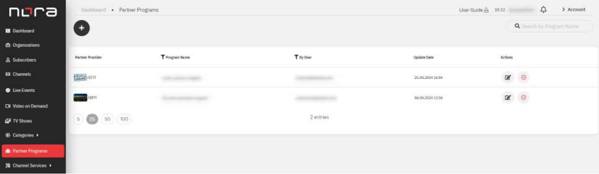
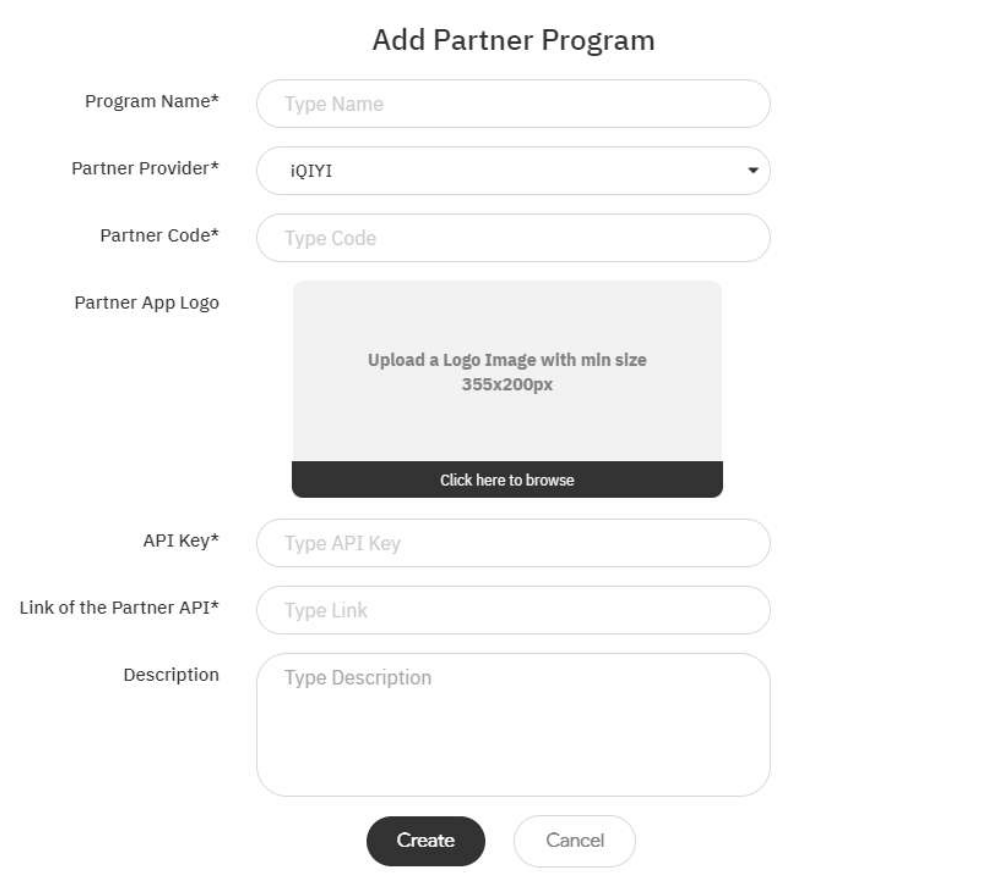

# Partner Programs

## Overview:

Module is intended for Partner Programs management. Partners Program (Partners
Access) - API settings for getting link to the Partner Application with access to the
Partner content

## List of Partner Programs

Path: Partner Programs (sidebar menu)

Picture 20.1.1 - List of Partner Programs

#|
||

\#

|

Name

|

Description

||
||

1

|

Add Partner Program

|

Click the button to go to Partner Program creation mode

||
||

2

|

Search by Program name

|

Search Partner Programs by name

||
||

3

|

Partner Provider

|

Display Partner Provider name with Partner App Logo.
Option to sort the list by Partner Provider in
ascending/descending order

||
||

4

|

Program Name

|

Display name of Partner Program. Option to sort the
list by Program Name in ascending/descending order.
Option to filter the list (search field) by Program Name

||
||

5

|

By User

|

Display name of the User who last updated the
Partner Program. Option to filter the list (search field)
by user’s email

||
||

6

|

Update Date

|

Display date and time of the last Partner Program
update or creation. Option to sort the list in
ascending/descending order

||
||

7

|

Actions:

|

||
||

7

|

Edit Partner Program

|

Click to go to Partner Program edit mode

||
||

7

|

Remove Partner Program

|

Delete Partner Program

||
|#

## Partner Programs Details

Path: Partner Programs (sidebar menu) \> Add Partner Program

Picture 20.2.1 - Partner Programs details

Table 20.2.1 - Partner Programs details

#|
||

\#

|

Name

|

Description

||
||

1

|

Program Name

|

Type Partner Program name

||
||

2

|

Partner Provider

|

Select Partner Provider from the list

||
||

3

|

Partner Code

|

Type the identification Code provided by the Partner
Provider

||
||

4

|

Partner App Logo

|

Upload Partner App Logo image

||
||

5

|

API Key

|

Specify provided by the Partner Provider API Key

||
||

6

|

Link of the Partner API

|

Specify provided by the Partner Provider URL to
Partner API

||
||

7

|

Description

|

Type Partner Program description

||
||

8

|

Create

|

Create Partner Program with filled data

||
||

9

|

Cancel

|

Cancel creation of Partner Program

||
|#

